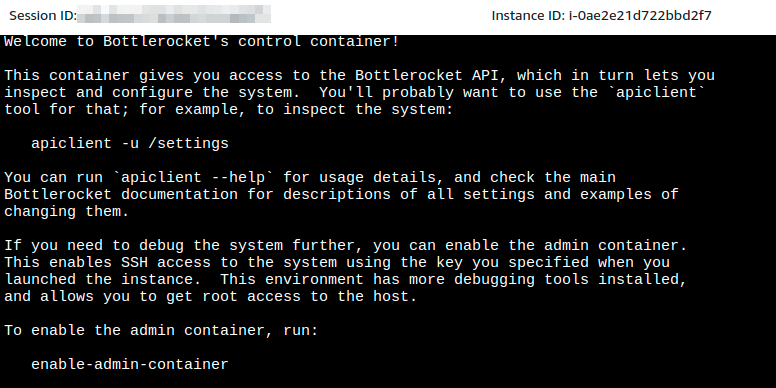

<p align="center">
  <a href="https://dev.to/vumdao">
    
  </a>
</p>
<h1 align="center">
  <div><b>AWS BottleRocket On EKS NodeGroup</b></div>
</h1>

## Abstract
- The footprints of Linux are increasing day by day and the latest addition to this is the Bottlerocket. It is a Linux-based operating system built by Amazon Web Services. This open-source OS targets to host and run the containers on virtual machines or bare metal hosts.
- Today, Amazon Elastic Kubernetes Services (Amazon EKS) announces native support for Bottlerocket in managed node groups. Bottlerocket is a Linux-based open-source operating system that is purpose-built by Amazon. It focuses on security and maintainability, and provides a reliable, consistent, and safe platform for container-based workloads
- Every Linux-based OS involves the Linux kernel—which manages hardware resources—and a set of software packages that make up the rest of the operating system. That's why the bottlerocket-OS promises a light-weight to boost up and high security.
- In this post, we will launch a Bottlerocket managed node group with lauch template on EKS cluster. It's not only about setting the nodegroup to use bottlerocket AMI but about the arguments at EKS node startup. Let's find out more


## Table Of Contents
 * [Why Should You Use Bottlerocket OS?](#Why-Should-You-Use-Bottlerocket-OS?)
 * [Create a lauch-template for EKS nodegroup](Create-a-lauch-template-for-EKS-nodegroup)
 * [Create ASG with the launch template](#Create-ASG-with-the-launch-template)
 * [Conclusion](#Conclusion)

---

## 🚀 **Why Should You Use Bottlerocket OS?** <a name="Why-Should-You-Use-Bottlerocket-OS?"></a>

Bottlerocket comes to the rescue when facing the above issues. The Bottlerocket OS tends to mitigate the challenges faced by container-based environments such as security, updates, compute cycles, start-up time, and the integrity of a cluster over time. Most of the components in Bottlerocket are written in Rust, so some of the memory safety issues are eliminated. The following are additional benefits of Bottlerocket:
- Improved uptime: You can apply updates to the Bottlerocket OS all at once, and they can also be rolled back as needed, improving uptime.
- Lower management overhead: You can utilize container orchestration services to automate updates to the Bottlerocket OS, reducing management overhead and operational costs.
- Better security and resource utilization: Contrary to other operating systems, you only have the essential components in Bottlerocket OS to run, creating a smaller attack surface and improving security.
- Optimized performance: Bottlerocket is optimized to run on Amazon EC2 and incorporates built-in support for integrations with AWS services.
- Read-only file system: Bottlerocket uses a read-only file system whose integrity is validated at the time of booting.
- Automated updates: You can automate updates via orchestration services like Amazon EKS. Unlike traditional Linux-based systems that use package-by-package updates, Bottlerocket utilizes image-based updates.
- Open development model: You can create code and design changes to the Bottlerocket OS via code available in Github. It should be noted that the Bottlerocket OS supports images formatted for Docker and OCI (Open Container Initiative).

## 🚀 **Create a lauch-template for EKS nodegroup** <a name="Create-a-lauch-template-for-EKS-nodegroup"></a>
1. Pre-requisite: EKS cluster
2. Here we will create an Auto scaling group with launch template contains following things
   - Bottlerocket AMI, to get the latest AMI ID align with EKS cluster version and AWS region, use SSM parameters store
   ```
   ~ $ aws ssm get-parameter --region ap-northeast-1 --name "/aws/service/bottlerocket/aws-k8s-1.18/x86_64/latest/image_id" --query Parameter.Value --output text
   ami-0a04f060889bcef33
   ```

   

   - Key-pair in order to SSH to the node for demonstration purpose
   - EKS VPC
   - Security group for Pod communications (Check out [Understand Pods communication](https://dev.to/aws-builders/understand-pods-communication-338c))

   

   - IAM instance profile which has enough permission for node to join EKS cluster, read more [AWS EKS - Launch Template Of Node Group](https://dev.to/aws-builders/aws-eks-launch-template-of-node-group-6a4)
   - **User data** (describe laters)
3. One of important thing is `user data` which contains additional arguments to `kubelet` service such as node lables, node taints.
   1. The user data must be in [TOML format](https://github.com/toml-lang/toml) and must contains `settings.kubernetes.cluster-certificate`, `settings.kubernetes.api-server`, and `settings.kubernetes.cluster-name` (Read more [Kubernetes settings](https://github.com/bottlerocket-os/bottlerocket#kubernetes-settings)).
   2. Following is `user data` example with `node-labels` and `node-taints`

    ```
    [settings.kubernetes]
    api-server = "https://abc.def.ap-northeast-1.eks.amazonaws.com"
    cluster-certificate = "TkQgQ0VSVElGSUNBVEUtLS0tLQo="
    cluster-name = "eks-dev"
    cluster-dns-ip = "10.100.0.10"

    [settings.kubernetes.node-labels]
    "lifecycle" = "on-demand"
    "role" = "airflow"
    "type" = "af-stateful"

    [settings.kubernetes.node-taints]
    "dedicated" = "airflow:NoSchedule"
    ```

   3. We can use `eksctl` to generate basic `userdata.toml`
    ```
    ~ $ eksctl get cluster --region ap-northeast-1 --name eks-dev -o json | jq --raw-output '.[] | "[settings.kubernetes]\napi-server = \"" + .Endpoint + "\"\ncluster-certificate =\"" + .CertificateAuthority.Data + "\"\ncluster-name = \"eks-dev\""' > userdata.toml
    ```

## 🚀 Create ASG with the launch template <a name="Create-ASG-with-the-launch-template"></a>
- After the ASG scales the desired capacity, we can check the bottlerocket nodes
- List the nodes in the EKS cluster along with the attributes of interest to us:

```
# kubectl get nodes -o=custom-columns=NODE:.metadata.name,ARCH:.status.nodeInfo.architecture,OS-Image:.status.nodeInfo.osImage,OS:.status.nodeInfo.operatingSystem | grep Bottlerocket
ip-172-10-12-246.ap-northeast-1.compute.internal   amd64   Bottlerocket OS 1.4.0 (aws-k8s-1.18)   linux
ip-172-10-14-51.ap-northeast-1.compute.internal    amd64   Bottlerocket OS 1.4.0 (aws-k8s-1.18)   linux
ip-172-10-21-118.ap-northeast-1.compute.internal   amd64   Bottlerocket OS 1.4.0 (aws-k8s-1.18)   linux
```

- Start an SSM session. In order to SSH to the node, it needs to run `enable-admin-container` (which is disabled by default) from SSM console



```
[ssm-user@ip-172-10-12-246 /]$ enable-admin-container
Setting admin container to enabled
204 No Content
Committing and applying changes
200 OK
["settings.host-containers.admin.enabled"]
The admin container is now enabled - it should pull and start soon, and then you can SSH in
```

- SSH to the node and see the difference from other Linux OS
  ```
  bash-4.2# systemctl status kubelet
  Running in chroot, ignoring request.
  ```

## 🚀 Conclusion <a name="Conclusion"></a>
- Bottlerocket is built from the ground up with only the minimum components necessary to run containers installed on the host. Any additional software such EFS CSI driver, monitoring agents, metric collections, etc. must be run as Daemonsets
- In this post, it shows how to use Bottlerocket natively with Amazon EKS managed node groups and how to interact directly with the Bottlerocket cluster nodes. It's interesting that AWS CDK will support bottlerocket managed nodegroup soon ([feat(aws-eks): support bottlerocket managed nodegroup](https://github.com/aws/aws-cdk/pull/17323))

---

References:
- [How to Get Started with Bottlerocket OS](https://epsagon.com/tools/how-to-get-started-with-bottlerocket-os/)
- [Amazon EKS adds native support for Bottlerocket in Managed Node Groups](https://aws.amazon.com/blogs/containers/amazon-eks-adds-native-support-for-bottlerocket-in-managed-node-groups/)

---

<h3 align="center">
  <a href="https://dev.to/vumdao">:stars: Blog</a>
  <span> · </span>
  <a href="https://github.com/vumdao/aws-bottlerocket-eks/">Github</a>
  <span> · </span>
  <a href="https://stackoverflow.com/users/11430272/vumdao">stackoverflow</a>
  <span> · </span>
  <a href="https://www.linkedin.com/in/vu-dao-9280ab43/">Linkedin</a>
  <span> · </span>
  <a href="https://www.linkedin.com/groups/12488649/">Group</a>
  <span> · </span>
  <a href="https://www.facebook.com/CloudOpz-104917804863956">Page</a>
  <span> · </span>
  <a href="https://twitter.com/VuDao81124667">Twitter :stars:</a>
</h3>
